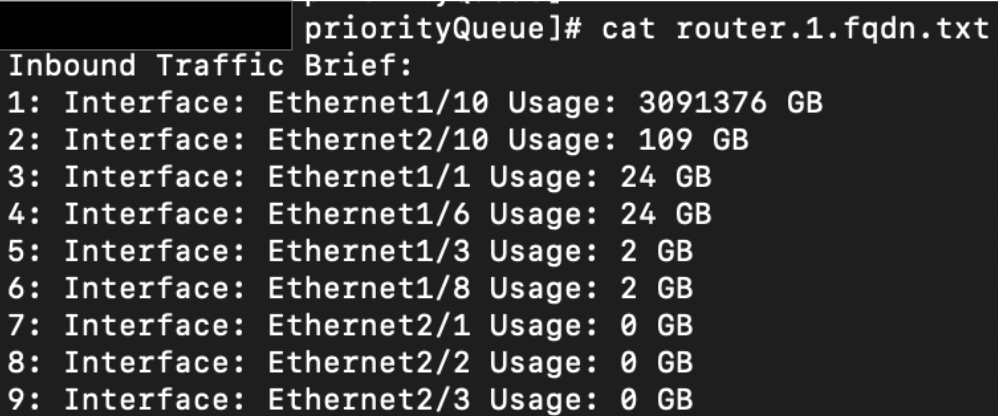

<div align="center">
  
</div>

# Network Interface Utilization Monitoring

A Python tool designed for network engineers to collect and analyze interface traffic from Cisco NX-OS devices. It leverages multi-threading and a priority queue to efficiently identify and rank the highest-traffic interfaces, delivering quick reports through the command-line interface (CLI) and text files.

# Project Description

This project, built with **Python 3.9**, automates the process of retrieving and analyzing network interface traffic data from **Cisco NX-OS devices**. It utilizes the **NX-API RESTconf** interface to fetch the output of the `show interface` command. The script processes this data to identify the interfaces with the highest **inbound** and **outbound** traffic, presenting the results in a human-readable format.

The script use **multithreaded**, which allows it to query multiple network devices concurrently, significantly reducing the time it takes to collect data from a large number of devices. The final results are saved to individual text files for each device and can also be printed directly to the console.

## Features

- **Multithreaded Data Collection**: Collects interface traffic data making queries to multiple network devices at the same time to enhance efficiency.
- **YAML Configuration**: Uses a YAML file (`network_config.yaml`) to store network device details and SSH credentials, making the script easy to configure and manage.
- **Traffic Analysis**: Calculates and identifies the interfaces with the highest inbound and outbound traffic, using a priority queue (via Python's heapq module) to sort the data.
- **Reporting and flexible Output**: Displays the results on the command-line interface and saves the analyzed data to a separate text file (<device_name>.txt) for each device.
- **Error Handling**: Gracefully handles scenarios where data cannot be retrieved from a network device, preventing the script from crashing.
- **Scalable**: Designed to handle large-scale network environments with multiple devices.

## Requirements

- Python 3.8 or higher
- Required Python libraries:
  - `heapq` (For priority Queue)
  - `queue` (For Priority Queue handled information)
  - `yaml` (For reading network_config.yaml file)
  - `requests` (For NXAPI Restconf Calls)
  - `json` (The return of NXAPI Methods are in json ox xml, i choose json)
  - `threading` (For multi threading)
  - `urllib3` (To disable Certificates expiration validation)
- Cisco NX-OS device with SSH access enabled
- Valid credentials for device access

## Installation

1. Clone the repository:
   
   ```bash
      git clone https://github.com/NetFreak85/Network-Interface-Utilization-Monitoring.git
      cd Network-Interface-Utilization-Monitoring
   ```

3. Install the required Python libraries:
   
   ```bash
      pip install PyYAML requests 
   ```

4. Ensure your Cisco NX-OS devices are configured for SSH access and you have the necessary credentials.

## Usage

1. Configure your device details (e.g., IP addresses, credentials) in a configuration file or directly in the script (refer to the script's documentation for details).

2. Run the tool:
   ```bash
      network_interface_traffic_analyzer.py
   ```

3. The tool will:
   
   - Connect to the specified **Cisco NX-OS devices**.
   - Collect interface traffic data using **multi-threading**.
   - Rank interfaces by traffic utilization using a **priority queue**.
   - Display results in the CLI and save them to a text file (e.g., `interface_report.txt`).

<space><space>

Example output:

<space><space>

```
   Inbound Traffic Brief:
   1: Interface: Ethernet1/10 Usage: 3091376 GB
   2: Interface: Ethernet2/10 Usage: 109 GB
   3: Interface: Ethernet1/1 Usage: 24 GB
   4: Interface: Ethernet1/6 Usage: 24 GB
   5: Interface: Ethernet1/3 Usage: 2 GB
   6: Interface: Ethernet1/8 Usage: 2 GB
   7: Interface: Ethernet2/1 Usage: 0 GB
   8: Interface: Ethernet2/2 Usage: 0 GB
   9: Interface: Ethernet2/3 Usage: 0 GB

```

<space><space>

  Example image:

<space><space>

<div align="center">
  
</div>

<space><space>

4. `Note: For debuging propose, you can set the PrintCLI variable to 'True' in the network_config.yaml to display the output in your terminal.`

## Configuration

- Edit the configuration file (e.g., `network_config.yaml`) to specify the credentials and the device list:
  ```yaml
     Credentials:

        username : ""     # Username for SSH Authentication
        password : ""     # Password for the Username

     NetworkDevice:
        - router.1.fqdn
        - router.2.fqdn
        - 1.2.3.4
        - 4.5.6.7
  ```

## Contributing

Contributions are welcome! To contribute:

1. Fork the repository.
2. Create a new branch (`git checkout -b feature-branch`).
3. Make your changes and commit them (`git commit -m <comment>`) 
